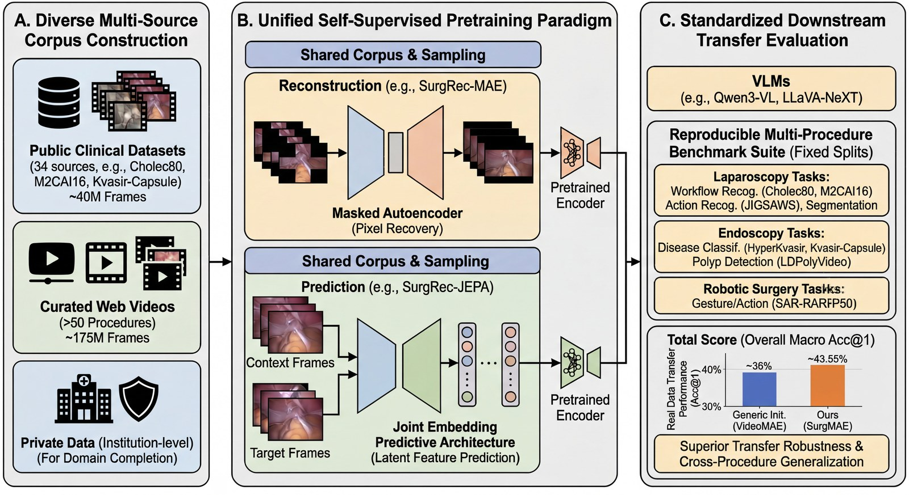

# SurgRec: Scaling Video Pretraining for Surgical Foundation Models

[](https://arxiv.org/abs/2603.29966)

[](https://creativecommons.org/licenses/by-nc/4.0/)
[](https://github.com/Siiichenggg/SurgRec-open-source/actions/workflows/ci.yml)

This repository is the public release for **SurgRec**: downstream fine-tuning code, the 16-dataset benchmark with consistent splits, VLM baseline evaluation, and the released pretrained backbones. It reproduces the paper's downstream results.

> Paper: [Scaling Video Pretraining for Surgical Foundation Models](https://arxiv.org/abs/2603.29966) (arXiv:2603.29966)  
> Checkpoints: coming soon — the SurgRec backbones will be released on the Hugging Face Hub.



<p align="center"><em>Overview of the proposed surgical video pretraining and evaluation framework.</em></p>

## Highlights

- Surgical video fine-tuning code with VideoMAE-style entrypoints.
- Unified downstream launcher covering the paper models (`surgrec_mae`, `surgrec_jepa`) and every baseline (`videomae`, `videomaev2`, `jepa_vitl16`, `dinov3`, `dinov3_surgenetxl`, `dino`, `endofm`, `mocov2`).
- The paper's own fine-tuning and test configurations, with their hyperparameters unchanged.
- Sanitized train/val/test split metadata for the 16-dataset paper benchmark plus auxiliary splits.
- VLM baseline evaluation scripts for Qwen3-VL, Qwen2.5-VL, and LLaVA-NeXT.

## Results

Top-1 accuracy (%) on the 16-dataset downstream benchmark, reproduced from
Table 2 of the [paper](https://arxiv.org/abs/2603.29966). Baselines are DINOv3,
DINOv3-Surg (SurgeNetXL), V-MAE (VideoMAE), SR-MAE without balanced sampling,
and JEPA; **bold** marks the best method on each dataset. SR-MAE and SR-JEPA are
SurgRec-MAE and SurgRec-JEPA.

| Dataset | DINOv3 | DINOv3-Surg | V-MAE | SR-MAE (w/o bal.) | JEPA | **SR-MAE** | **SR-JEPA** |
| --- | --- | --- | --- | --- | --- | --- | --- |
| AlxSuture | 32.61 | 39.13 | 39.13 | 39.13 | 39.13 | **43.48** | 39.13 |
| AutoLaparo | 17.74 | 19.35 | 19.35 | 17.74 | 20.97 | **22.58** | 17.74 |
| cat-21 | 15.69 | 15.69 | 15.69 | 15.69 | 15.69 | 15.69 | 15.69 |
| cataract-101 | 17.97 | 19.53 | 19.53 | 21.09 | 24.22 | **35.16** | 23.44 |
| cataract-1k | 9.90 | 14.85 | 11.88 | 16.83 | 19.80 | **18.81** | 17.82 |
| Cholec80 | 22.34 | 16.12 | 14.65 | 24.18 | 26.01 | 29.30 | **31.14** |
| Colonoscopic | 53.33 | 53.33 | 53.33 | 53.33 | 53.33 | **73.33** | 53.33 |
| Hyper-Kvasir | 43.03 | 41.81 | 25.11 | 36.91 | 41.65 | **55.28** | 42.27 |
| JIGSAWS | 18.12 | 17.11 | 15.67 | 21.23 | 29.72 | **47.49** | 32.24 |
| Kvasir-Capsule | 46.34 | 47.56 | 19.51 | 46.34 | 48.78 | **73.17** | 60.98 |
| LapGyn4 | 62.68 | 65.63 | 62.68 | 67.07 | 60.66 | **68.13** | 64.13 |
| LDPolyVideo | 90.35 | 90.35 | 90.35 | 90.35 | 90.35 | **90.76** | 90.42 |
| M2CAI16 | 23.01 | 25.66 | 12.39 | 30.09 | 26.55 | **38.05** | **38.05** |
| MultiBypass140 | 38.62 | 42.63 | 20.54 | 51.56 | 12.88 | **56.92** | 56.47 |
| SurgicalActions160 | 6.25 | 6.25 | 6.25 | **18.75** | 12.50 | **18.75** | 6.25 |
| SAR-RARP50 | 23.01 | 26.88 | 25.97 | 24.37 | 22.10 | **37.59** | 36.67 |
| **Mean** | 32.56 | 33.87 | 28.25 | 35.92 | 34.02 | **45.28** | 39.11 |

SurgRec-MAE is the best method on 14 of 16 datasets and leads the mean by 9.4
points over the strongest baseline (SR-MAE without balanced sampling, 35.92).
See [docs/benchmark.md](docs/benchmark.md) to reproduce these runs.

## Repository Layout

```text
surgrec_video/   Python package for downstream video fine-tuning
scripts/         Public shell entrypoints for training and VLM evaluation
scripts/paper/   The paper's own fine-tuning and test configurations
splits/          Lightweight downstream split metadata; no raw videos
tools/           Data preparation, validation, and analysis helpers
vlm_eval/        VLM baseline evaluation code
configs/         Model registry mapping backbones to checkpoint filenames
docs/            Benchmark notes
```

## Quick Start

```bash
conda create -n surgrec python=3.10 -y
conda activate surgrec
pip install -r requirements.txt
```

Download the pretrained backbones (coming soon — see [Model Zoo](MODEL_ZOO.md)):

```bash
# Checkpoints will be released on the Hugging Face Hub; command added on release.
# hf download <repo> --local-dir checkpoints
```

Prepare dataset CSVs with local absolute video paths:

```bash
python tools/data/relocate_splits.py   --input-root splits   --output-root data/splits_local   --data-root /path/to/your/dataset_root
```

List available downstream datasets and supported backbones:

```bash
DATASET_ROOT=data/splits_local bash scripts/train/finetune_surgrec_video.sh --list
bash scripts/train/finetune_surgrec_video.sh --list-backbones
```

Fine-tune a checkpoint on one downstream dataset:

```bash
DATASET_ROOT=data/splits_local CKPT_ROOT=checkpoints GPUS=8 bash scripts/train/finetune_surgrec_video.sh cholec80 --backbone surgrec_mae
```

Reproduce a paper run with its original hyperparameters:

```bash
CKPT_ROOT=checkpoints DATA_ROOT=/path/to/split GPUS=8 \
  bash scripts/paper/finetune/videomae_e149_finetune_8gpu.sh
```

Run the paper benchmark launchers in dry-run mode before starting long jobs:

```bash
DATASET_ROOT=data/splits_local bash scripts/benchmark/run_ssl_benchmark.sh --dry-run
DATASET_ROOT=data/splits_local bash scripts/benchmark/run_vlm_benchmark.sh --dry-run
```

Run a VLM baseline evaluation:

```bash
DATASET_ROOT=data/splits_local MODEL_ROOT=/path/to/vlm_checkpoints bash scripts/eval/evaluate_vlm.sh cholec80 qwen3
```

## What Is Not Included

- Raw clinical or web videos.
- Baseline and third-party VLM weights — obtain those from their original sources. The two SurgRec backbones will be released on the Hugging Face Hub.
- TensorBoard files, generated outputs, caches, or conda environments.
- Historical experiment forks.
- Private/internal datasets unless their licenses permit redistribution.

## Release Notes For Maintainers

`RELEASE_CHECKLIST.md` tracks what remains: the final license decision, third-party license compatibility, and per-dataset redistribution terms for the splits.

## License

Released under [CC BY-NC 4.0](https://creativecommons.org/licenses/by-nc/4.0/):
non-commercial use with attribution. Parts of this codebase derive from
VideoMAE, which carries the same non-commercial obligation. Baseline
checkpoints, VLM weights, and downstream datasets are not redistributed here and
remain under their own terms — see `LICENSE` and `NOTICE`.

This is a research artifact, not a medical device, and must not be used for
clinical decisions.

## Acknowledgements

This project builds on VideoMAE, VideoMAE V2, timm, PyTorch, decord, and related open-source surgical-video and VLM tooling. Third-party components retain their original licenses; see `NOTICE`.

## Citation

```bibtex
@article{lu2026surgrec,
  title   = {Scaling Video Pretraining for Surgical Foundation Models},
  author  = {Lu, Sicheng and Xiao, Zikai and Wei, Jianhui and Sun, Danyu and
             Lu, Qi and Hu, Keli and Feng, Yang and Wu, Jian and Yang, Zongxin
             and Liu, Zuozhu},
  journal = {arXiv preprint arXiv:2603.29966},
  year    = {2026},
  url     = {https://arxiv.org/abs/2603.29966}
}
```
